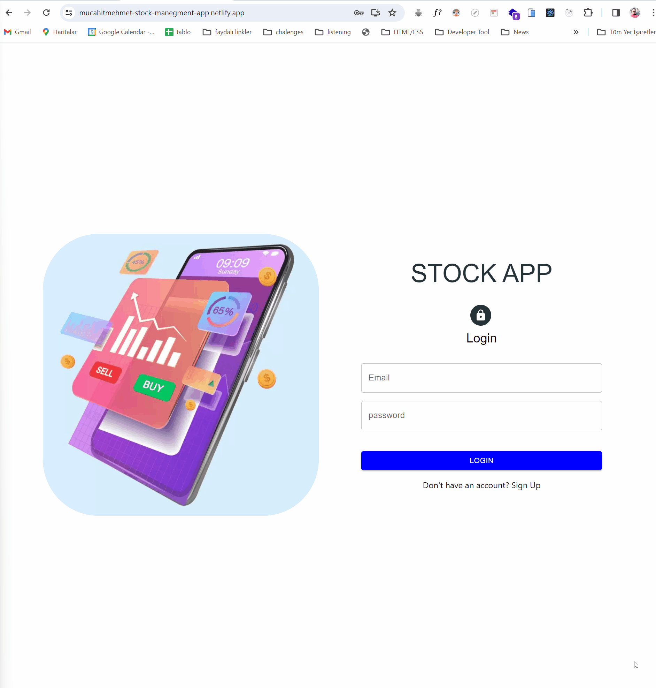

✨ I'm delighted to introduce the Stock Management App project I've been diligently working on. Here's a brief overview of the project:

Description:
In this Stock Management App project, I've developed a multi-page frontend web application that incorporates global state management through Redux. The backend, powered by Node.js, utilizes REST APIs for seamless communication.

Tech/Framework Used:
🎯 React.js
🎯 React-redux
🎯 Redux/Toolkit
🎯 React-Router-Dom
🎯 Redux-Persist
🎯 Axios - Instance
🎯 Material UI
🎯 REST API
🎯 POSTMAN
🎯 Redux DevTool

Project Structure:
Created the project using create-react-app.
Strategically planned the page structure with react-router.
Implemented global state management for product information using Redux and Redux-toolkit.
Conducted validation operations for product details using Formik and Yup libraries.
Developed page contents post-testing API requests through Postman.
Displayed product details as cards on the stock management pages; incorporated modal structures for adding and editing information.
Executed all CRUD operations by sending requests to the API for product management.
Controlled transactions made with Axios by creating a custom hook in the global state.
Stored product information using React-persist.
Utilized Material UI libraries for styling.

This project is a culmination of extensive planning, meticulous development, and the integration of cutting-edge technologies in the realm of stock management. I'm excited to share the outcomes and insights gained through this journey. Stay tuned for more updates on my blog! ✨

## LİVE

[Stock App](https://mucahitmehmet-stock-manegment-app.netlify.app/)

